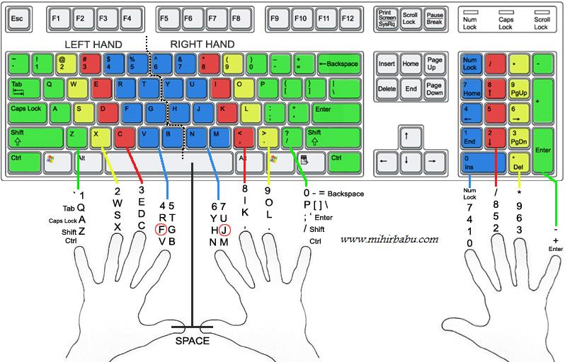

  

# typingSkills
All information about typing skills to increase typing speed WPM(word per minute)

## Websites
1. https://play.typeracer.com/
2. https://www.keybr.com/
3. https://zty.pe/

## Guide

* Tips 
  - [x] Do not look at the keyboard
  - [x] Also remember to use the correct fingers
  - [ ] Take the path of least resistance
  - [ ] Gaming =/= (typing) exercise/Type a lot everyday

